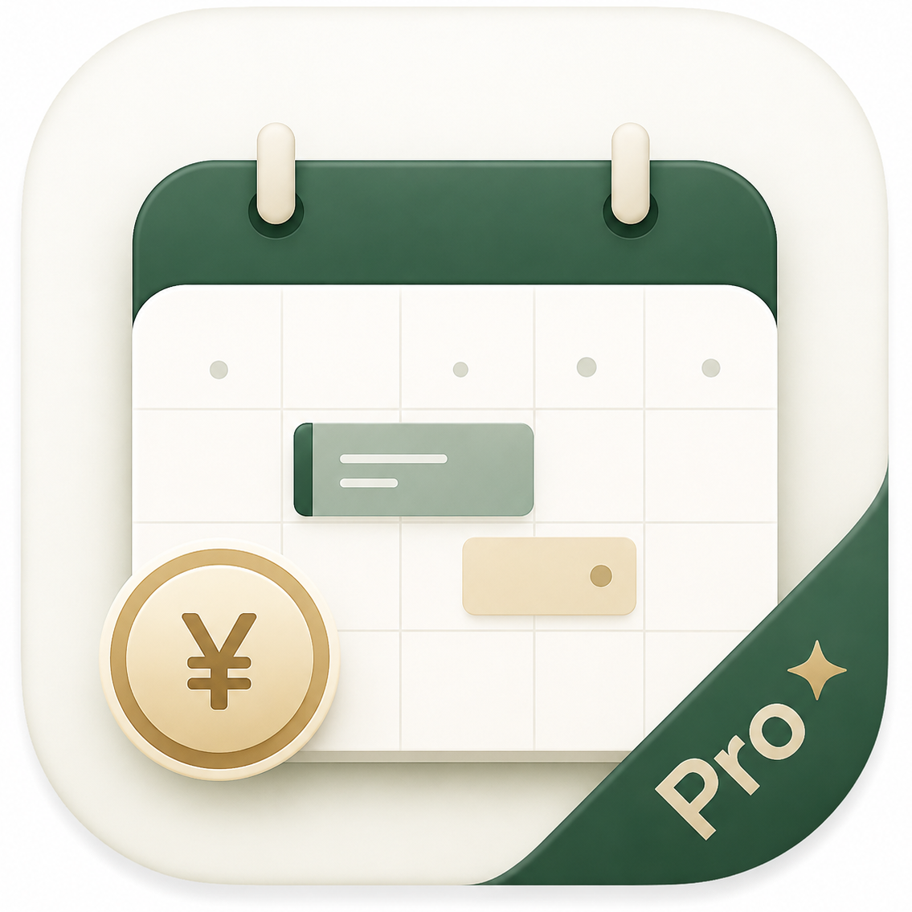

# 工作日历pro

> 让每一段时间，都有价值。 Every hour counts.



面向家教老师、自由职业者和个人工作者的日程与收入管理工具。

## 快速开始

### 网页版

直接打开 `index.html`，或部署到 GitHub Pages、Cloudflare Pages、Vercel 等静态托管平台。

### 桌面版

```powershell
npm install
npm run desktop
```

构建 Windows 安装程序：`npm run desktop:build`

## 功能总览

| 日历 | 收入 | 管理 |
| --- | --- | --- |
| 月视图 / 周视图 | 工时收入 | 标签与客户 |
| 点击、长按拖拽新建 | 其他收入 | 回收站恢复 |
| 拖动改时间、调整时长 | 月度收入目标 | 日程模板 |
| 重叠日程智能缩进 | 月 / 年 / 自定义统计 | JSON 备份迁移 |

## 周视图交互

- 点击空白时间创建 30 分钟草稿。
- 长按拖动创建一段时间。
- 拖动日程可移动日期和开始时间。
- 底部手柄按 15 分钟调整时长。
- 重叠日程依次缩进，保持卡片可读性。
- 支持右键或 `Ctrl+C / Ctrl+V` 复制粘贴。

## 收入与分类

日程可记录开始/结束时间、收入、线上/线下、客户和多个标签，价格会显示在日历卡片上。

其他收入用于记录投资、补助、奖学金和生活费等不占用日历的收入，支持年月筛选、标签统计和重复记录。

标签支持多选、预设颜色、自定义颜色、重命名和删除；客户可以独立维护，并显示在日程卡片中。

## 统计与输出

- 本月、本年、自定义期间三种统计范围。
- 总收入、收入目标、日程数、有收入小时数和客户数量。
- 标签、客户、线上/线下三种构成分析。
- GitHub 风格 Contribution Graph，可按标签筛选并点击日期定位。
- 周表 / 月表、日历 / 列表两种输出布局。
- 可隐藏日程名称和客户名称，并导出 PNG 图片。

## 智能录入

```text
9.1-9.3 10:00-12:00 雅思助教 外包 收入300
```

支持日期、日期范围、时间段、收入、标签、客户和线上/线下识别，识别结果可以继续编辑。

## 数据与隐私

- 网页版数据保存在当前浏览器的 `localStorage`。
- 桌面版数据保存在 Electron 用户数据目录。
- GitHub 仓库只保存程序代码和资源，不保存个人日程数据。
- 建议定期导出 JSON 备份，未来可用于桌面端和手机端迁移。

## 项目结构

```text
index.html       网页结构
styles.css       视觉样式
app.js           日历、统计与交互逻辑
desktop/         Electron 桌面端
assets/          图标与静态资源
```
